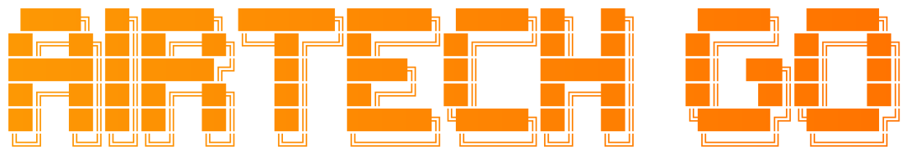

  

Creador de contenido tecnológico en YouTube. Este GitHub reúne el material que acompaña a los vídeos: configuraciones, scripts y documentación.

## Sobre AirTech Go

AirTech Go es un proyecto independiente centrado en Linux, sistemas Unix-like y software que promete mucho pero exige tiempo o configuración para sacarle todo el partido.

No parto de la experiencia de un experto, sino de la curiosidad de alguien que quiere entender algo, probarlo a fondo y compartir lo aprendido.

## Cómo se experimenta

AirTech Go no da por buena una herramienta solo porque tenga buenas características o sea popular. Antes de opinar, el proceso es siempre el mismo: investigar el proyecto, configurarlo, usarlo el tiempo suficiente para entenderlo de verdad y documentar tanto lo bueno como lo malo.

El resultado puede ser positivo, negativo o algo intermedio — la prioridad es la experiencia real, no defender una conclusión ya decidida de antemano. Todo el proceso completo queda documentado en YouTube.

## Colaboraciones

AirTech Go está abierto a colaboraciones con marcas y proyectos de tecnología, hardware y software, siempre integradas de forma natural en contenido de experimentación real.

El producto o servicio se prueba antes de opinar, y la valoración final refleja esa experiencia, no la colaboración en sí. Para propuestas comerciales, usa el contacto de abajo.

## Contacto profesional

